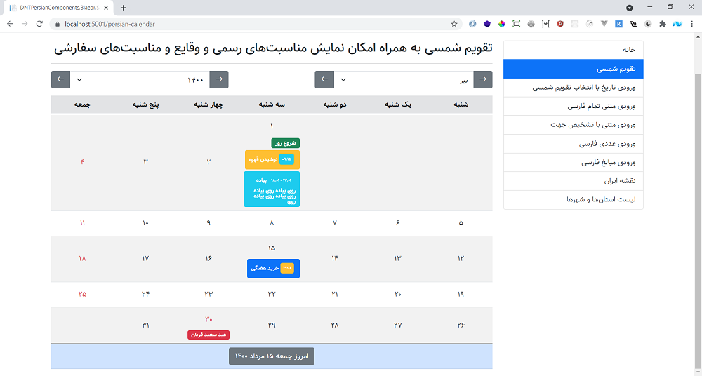

<div dir="rtl">

## DNTPersianComponents.Blazor ؛ مجموعه کامپوننت‌های فارسی مخصوص Blazor

</div>

<p align="left">
  <a href="https://github.com/VahidN/DNTPersianComponents.Blazor">
     
  </a>
</p>

<div dir="rtl">

## نصب از طریق NuGet

برای نصب DNTPersianComponents.Blazor، می‌توانید دستور پاورشل زیر را اجرا کنید:

[](https://github.com/VahidN/DNTPersianComponents.Blazor)

<div dir="ltr">
  
```powershell
PM> Install-Package DNTPersianComponents.Blazor
```
  
</div>
  
[مشاهده‌ی صفحه‌ی این بسته در سایت نیوگت](http://www.nuget.org/packages/DNTPersianComponents.Blazor/)

## پیشنیازها

این کامپوننت‌ها، مخصوص بوت استرپ 5 راست به چپ استاندارد تهیه شده‌اند. به همین جهت پیش از کار با آن‌ها نیاز است تنظیمات مخصوص به بوت استرپ را انجام دهید که شامل موارد زیر هستند:

الف) نصب بوت استرپ، آیکن‌های آن و نصب یک فونت اختیاری

<div dir="ltr">

```powershell
dotnet tool update -g Microsoft.Web.LibraryManager.Cli
libman install bootstrap --provider unpkg --destination wwwroot/lib/bootstrap
libman install bootstrap-icons --provider unpkg --destination wwwroot/lib/bootstrap-icons
libman install samim-font --provider unpkg --destination wwwroot/lib/samim-font
```

</div>

ب) اصلاح فایل [app.css](src/DNTPersianComponents.Blazor.WasmSample/Client/wwwroot/css/app.css) جهت معرفی فونت‌ها

ج) اصلاح فایل آغازین برنامه مانند [index.html](src/DNTPersianComponents.Blazor.WasmSample/Client/wwwroot/index.html) جهت راست به چپ کردن آن و همچنین استفاده از فایل‌های CSS دریافتی

د) فضاهای نام زیر را به فایل Imports.razor اضافه کنید:

<div dir="ltr">
  
```C#
@using DNTPersianComponents.Blazor
@using DNTPersianUtils.Core
@using DNTPersianUtils.Core.IranCities
```

</div>  
  
## کامپوننت‌های مهیا

- [DntInputPersianDate](src/DNTPersianComponents.Blazor.WasmSample/Client/Pages/InputPersianDate.razor): ورودی تاریخ شمسی به همراه امکان انتخاب آن از یک تقویم شمسی
- [DntPersianCalendar](src/DNTPersianComponents.Blazor.WasmSample/Client/Pages/CustomPersianCalendar.razor): تقویم شمسی به همراه امکان نمایش مناسبت‌های رسمی و وقایع و مناسبت‌های سفارشی
- [DntIranMap](src/DNTPersianComponents.Blazor.WasmSample/Client/Pages/ShowIranMap.razor): نقشه ایران با قابلیت انتخاب استان‌ها و یا تغییر رنگ آن‌ها
- [DntInputIranCities](src/DNTPersianComponents.Blazor.WasmSample/Client/Pages/InputIranCities.razor): ورودی انتخاب نام استان‌ها و شهرستان‌های ایران
- [DntInputNumber](src/DNTPersianComponents.Blazor.WasmSample/Client/Pages/NumberInput.razor): ورودی عددی با امکان دریافت و یا نمایش اعداد فارسی
- [DntInputCurrency](src/DNTPersianComponents.Blazor.WasmSample/Client/Pages/CurrencyInput.razor): ورودی مبالغ فارسی به همراه جداکننده‌ی سه رقمی هزارها و نمایش عدد به رقم
- [DntInputFarsi و DntInputTextAreaFarsi](src/DNTPersianComponents.Blazor.WasmSample/Client/Pages/InputFarsi.razor): ورودی تمام فارسی برای مواقعی که صفحه کلید فارسی در دسترس نیست
- [DntInputText و DntInputTextArea](src/DNTPersianComponents.Blazor.WasmSample/Client/Pages/CustomTextArea.razor): ورودی متنی با امکان تشخیص جهت راست به چپ و یا چپ به راست ورودی

## مثال‌ها



- [مثال Blazor WASM](src/DNTPersianComponents.Blazor.WasmSample/)
- [مثال Blazor Server](src/DNTPersianComponents.Blazor.ServerSample/)

## دمو

[مشاهده‌ی دموی مثال‌های فوق](https://vahidn.github.io/DNTPersianComponents.Blazor)
